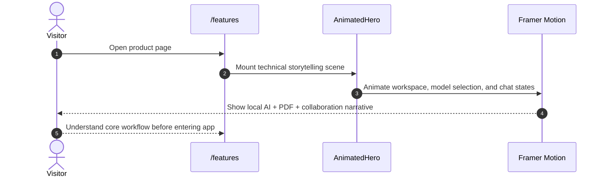
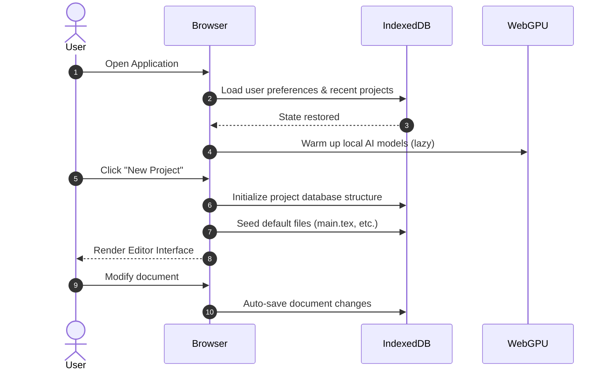
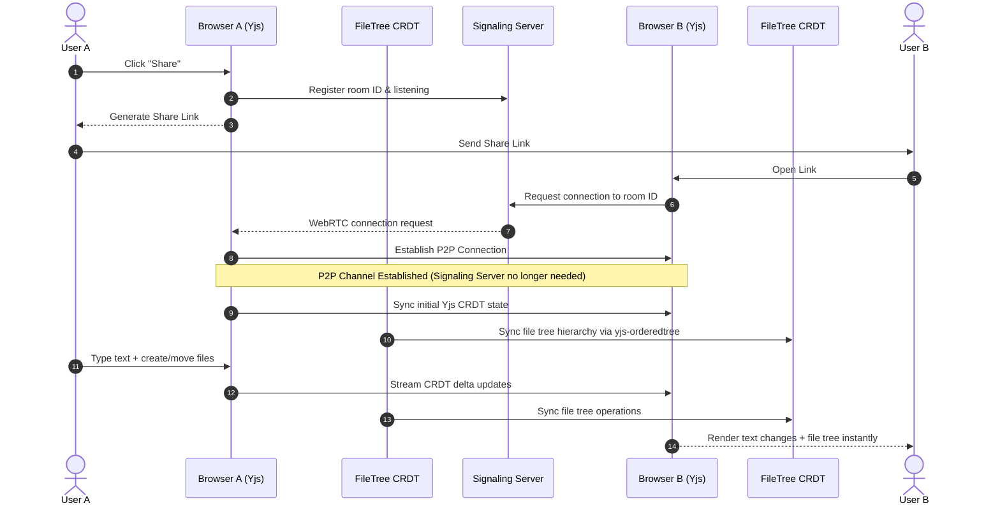
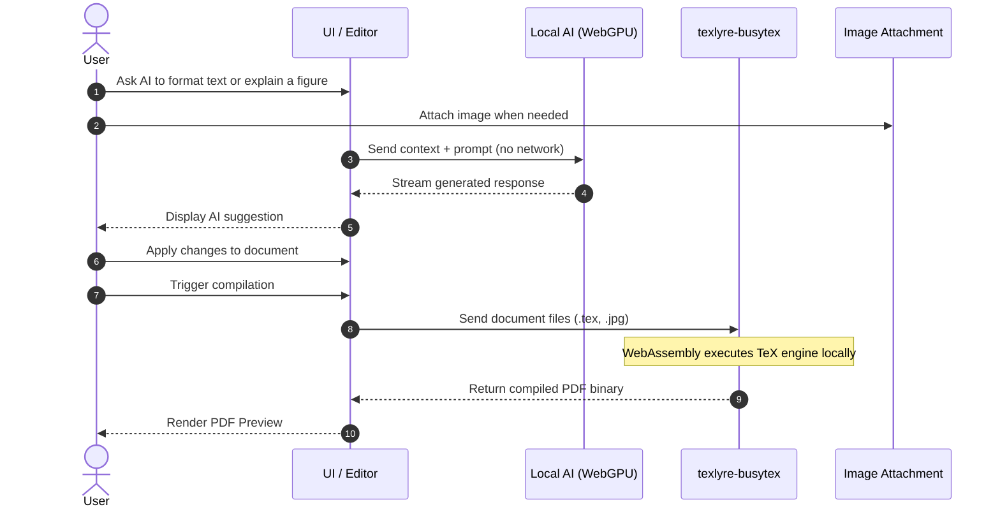

# Antiprism

[](https://deepwiki.com/lopkiloinm/antiprism)

**Antiprism** is a local-first research workspace for scientific writing, compilation, collaboration, Git history, and in-browser AI. It is the client-side counterpart to [Prism](https://prism.openai.com): where Prism leans on cloud infrastructure, Antiprism keeps the core experience in your browser with WebRTC, IndexedDB, WebAssembly, and WebGPU.

The README is intentionally more technical than the product tour on `/features`. The landing page explains the experience in a user-friendly way; this document explains how the app is structured, which models power it, which routes exist, and how the browser-native stack fits together.

## Product Surfaces

- **`/` Dashboard**: Project and room management, search, import flows, view modes, and entry into local or shared workspaces.
- **`/project/[id]` Workspace**: CodeMirror editor, PDF preview, AI chat, tools/logging, Git panel, file tree, and collaboration state.
- **`/features` Product Tour**: Marketing and storytelling surface with Framer Motion and `AnimatedHero.tsx` to visualize model selection, streaming text, PDF preview, multimodal prompting, and WebRTC sync.
- **`/document-parser` and `/git`**: Focused utility/demo routes for parser and Git-oriented flows.

## Architecture: Antiprism vs Prism

| Component | Prism (cloud) | Antiprism (client-side) |
|-----------|---------------|-------------------------|
| **Realtime collaboration** | WebSockets via central server | WebRTC + Yjs (peer-to-peer) |
| **AI assistant** | OpenAI API (datacenter) | Multiple ONNX models (WebGPU) |
| **LaTeX rendering** | Cloud compilation | Client-side WASM (texlyre-busytex) |
| **Data storage** | Server-side | IndexedDB, local-first |

- **WebRTC + Yjs**: Peers connect directly; a signaling server only helps establish connections and never sees document content.
- **WebGPU AI**: Multiple ONNX models run in-browser, including LiquidAI LFM2.5 series, Nanbeige4.1-3B, and Qwen3.5-0.8B. Models download on demand, cache locally, and stream responses without sending prompts to a hosted inference service.
- **Client-side LaTeX**: [texlyre-busytex](https://github.com/TeXlyre/texlyre-busytex) compiles and renders PDFs locally via WebAssembly.
- **Pandoc WASM**: The Agent mode outputs markdown (the model's native format); [pandoc-wasm](https://www.npmjs.com/package/pandoc-wasm) converts it to LaTeX in the browser.

### Key Features

- **Local-first persistence**: IndexedDB-backed projects, room state, AI settings, and autosaved editor content survive refreshes and reconnects.
- **Peer-to-peer collaboration**: Yjs CRDT state syncs over WebRTC, with share links and signaling used only to establish peers.
- **Multiple local AI models**: Switch between instruction, thinking, long-context, and vision-capable ONNX models inside the browser.
- **LaTeX-native workflow**: Edit `.tex`, compile locally, inspect logs, preview PDFs, and keep supporting assets in the same workspace.
- **Integrated Git**: Commit history, staging, branches, and diff inspection live alongside the writing surface.
- **Debuggability**: Tools panel, compilation logs, AI logs, and system traces make browser-native behavior inspectable instead of opaque.
- **Polished product storytelling**: The `/features` route uses Framer Motion and a custom animated hero to show real workflows without needing a live backend.
- **Adaptive UI shell**: Resizable panels, keyboard shortcuts, file tabs, and route-specific views support both focused writing and exploratory workflows.

### AI Chat Modes

| Mode | Purpose | Context | Model Used |
|------|---------|---------|------------|
| **Ask** | Document-aware Q&A, edits, and LaTeX assistance | Active document + conversation history | Active text model (LFM2.5 Instruct, LFM2.5 Thinking, Nanbeige4.1-3B, or Nemotron 3 Nano 4B) |
| **Agent** | Generate or restructure papers through a markdown-first workflow | Conversation history + structured agent prompts | Active text model with pandoc-wasm conversion back to LaTeX |
| **Vision** | Image + text analysis inside the chat workflow | Uploaded image + prompt | Active vision-capable model |
| **Multimodal** | Higher-fidelity visual reasoning and image-grounded explanations | Uploaded image + prompt + conversation context | Typically Qwen3.5-0.8B, or another selected vision-capable model |

#### AI Models Overview

Antiprism currently defines seven local model profiles in `lib/modelConfig.ts`. They are downloaded on demand, cached with the Cache API, and executed through ONNX Runtime Web + WebGPU:

**1. LFM2.5-1.2B Q4 (Instruct Model)**
- **Purpose**: Text generation for chat, LaTeX assistance, and document creation
- **Architecture**: 1.2 billion parameters, 4-bit quantized for efficient browser execution
- **Runtime Profile**: `q4`, `maxContextTokens: 32,768`, `maxNewTokens: 512`
- **Processing**: Converts text tokens to embeddings and streams responses autoregressively
- **Specialization**: Instruction-following chat model trained for academic and technical writing
- **Runtime**: ONNX WebGPU inference with ~2GB memory usage
- **Use Cases**: 
  - Answering questions about your LaTeX document
  - Explaining LaTeX syntax and concepts
  - Generating new content in markdown format (converted to LaTeX via pandoc-wasm)

**2. LFM2.5-VL-1.6B (Vision Model)**
- **Purpose**: Multimodal understanding of images combined with text
- **Architecture**: 1.6 billion parameters with vision encoder and language model
- **Runtime Profile**: Dedicated VLM, `q4`, `maxContextTokens: 32,768`, `maxNewTokens: 64`
- **Processing Pipeline**:
  1. **Image Preprocessing**: Splits images into 512×512 tiles, extracts 16×16 patches
  2. **Patch Encoding**: Each patch flattened to 768 values, normalized to [-1, 1]
  3. **Vision Encoder**: Processes patches through transformer layers
  4. **Multimodal Fusion**: Combines image embeddings with text token embeddings
- **Technical Details**:
  - Input shapes: `pixel_values: [num_tiles, 1024, 768]`, `attention_mask: [num_tiles, 1024]`
  - Supports up to 10 tiles + thumbnail for high-resolution images
  - Float16 precision for efficient GPU computation
- **Use Cases**:
  - Analyzing diagrams, charts, and mathematical figures
  - Explaining screenshots and visual content
  - Converting handwritten equations to LaTeX

**3. LFM2.5-1.2B (Thinking Model)**
- **Purpose**: Enhanced reasoning and step-by-step problem solving
- **Architecture**: Same 1.2B parameter base with specialized reasoning training
- **Runtime Profile**: `q4`, `maxContextTokens: 32,768`, `maxNewTokens: 512`, `thinking: true`
- **Processing**: Uses chain-of-thought prompting for complex problem decomposition
- **Specialization**: Trained for mathematical reasoning, proof generation, and logical deduction
- **Use Cases**:
  - Solving mathematical problems step-by-step
  - Generating proof structures and logical arguments
  - Debugging complex LaTeX code with reasoning

**4. Nanbeige4.1-3B (Advanced Thinking & Agentic Model)**
- **Purpose**: Sophisticated reasoning, deep research, and autonomous task execution
- **Architecture**: 3 billion parameters with a larger hidden size and long-context profile for heavier text workflows
- **Runtime Profile**: `q4`, `maxContextTokens: 262,144`, `maxNewTokens: 2,048`, `hiddenSize: 2,560`
- **Processing Pipeline**:
  1. **Advanced Reasoning**: Multi-step thinking with self-correction and verification loops
  2. **Deep Research**: Systematic information gathering and synthesis across multiple sources
  3. **Agentic Planning**: Autonomous task decomposition and execution with goal-oriented behavior
  4. **Context Integration**: Seamless blending of document analysis with external knowledge synthesis
- **Specialization**: Trained for complex research workflows, academic writing, and autonomous problem-solving
- **Technical Details**:
  - Extended context window for comprehensive document analysis
  - Enhanced chain-of-thought with verification and self-critique mechanisms
  - Built-in research methodology and systematic exploration patterns
- **Use Cases**:
  - Conducting comprehensive literature reviews and research synthesis
  - Autonomous academic paper generation with proper citations and structure
  - Complex problem-solving requiring multi-domain knowledge integration
  - Advanced LaTeX document creation with sophisticated mathematical content
  - Agentic research workflows with autonomous information gathering and analysis

**5. Qwen3.5-0.8B (Alibaba Multimodal Model)**
- **Purpose**: Advanced vision-language understanding with enhanced reasoning capabilities
- **Architecture**: 0.8 billion parameters with unified vision-language foundation from Alibaba's Qwen team
- **Runtime Profile**: Omnimodal `q4f16`, `maxContextTokens: 262,144`, `maxNewTokens: 32,768`
- **Processing Pipeline**:
  1. **Vision Encoder**: Processes images through 16×16 patch extraction and transformer layers
  2. **Multimodal Fusion**: Early fusion of vision and language tokens for comprehensive understanding
  3. **Gated Delta Networks**: Efficient hybrid architecture with sparse Mixture-of-Experts
  4. **Enhanced Reasoning**: Built-in thinking capabilities for complex problem solving
- **Technical Details**:
  - Supports up to 262,144 token context length natively
  - Float16 precision for vision encoder, 4-bit quantized for text components
  - WebGPU-optimized with per-component dtype configuration
- **Multimodal Capabilities**:
  - Analyzing complex diagrams, charts, and mathematical figures
  - Understanding screenshots with detailed visual reasoning
  - Converting handwritten equations and diagrams to LaTeX
  - Processing multiple images in conversation context
- **Vision Support**:
  - Image preprocessing with 448×448 resizing
  - Multi-tile processing for high-resolution images
  - Visual token integration with text tokens
  - Cross-generational parity with text-only performance

**6. Nemotron 3 Nano 4B (NVIDIA Reasoning Model)**
- **Purpose**: Fast, compact reasoning and drafting with structured thinking output
- **Architecture**: 4B parameters, BF16 base, exported as q4f16 for efficient browser execution
- **Runtime Profile**: `q4f16`, `maxContextTokens: 262,144`, `maxNewTokens: 2,048`
- **Processing/Behavior**:
  - Emits structured `<think>...</think>` reasoning blocks alongside final answers
  - Optimized for concise, latency-friendly replies
  - Uses the same chat template/logging and streaming path as other text models
- **Use Cases**:
  - Lightweight local reasoning when you want faster turnaround than larger models
  - Short-form drafting, quick Q&A, and code/math helpers
  - Experiments with NVIDIA’s thinking-style outputs inside the Antiprism UI

**7. Gemma 4 E2B (Google DeepMind Multimodal Model)**
- **Purpose**: Advanced multimodal understanding with text, image, and audio processing capabilities
- **Architecture**: 2.3 billion effective parameters with unified multimodal foundation from Google DeepMind
- **Runtime Profile**: Omnimodal `q4f16`, `maxContextTokens: 128,000`, `maxNewTokens: 2,048`
- **Processing Pipeline**:
  1. **Text Encoder**: Processes text tokens through transformer layers with efficient attention mechanisms
  2. **Vision Encoder**: Processes images through patch extraction and multimodal fusion
  3. **Audio Encoder**: Processes audio sequences for speech understanding and translation (framework ready)
  4. **Multimodal Fusion**: Early fusion of text, vision, and audio tokens for comprehensive understanding
  5. **Enhanced Reasoning**: Built-in thinking capabilities for complex problem solving across modalities
- **Technical Details**:
  - Supports 128,000 token context length with efficient memory usage
  - Float16 precision for vision and audio encoders, 4-bit quantized for text components
  - WebGPU-optimized with per-component dtype configuration
  - Unified architecture enables seamless cross-modal reasoning
- **Multimodal Capabilities**:
  - Analyzing complex diagrams, charts, and mathematical figures with visual reasoning
  - Understanding screenshots with detailed visual context and explanations
  - Converting handwritten equations and diagrams to LaTeX with high accuracy
  - Processing multiple images and audio inputs in conversation context
  - Speech recognition and translation capabilities (infrastructure ready)
- **Vision Support**:
  - Image preprocessing with 448×448 resizing and normalization
  - Multi-tile processing for high-resolution images and detailed analysis
  - Visual token integration with text tokens for unified understanding
  - Cross-generational parity with text-only performance
- **Audio Support**:
  - Audio encoder framework ready for speech processing
  - Designed for speech-to-text and translation workflows
  - Multilingual audio understanding capabilities
  - Integration with multimodal reasoning pipeline
- **Use Cases**:
  - Advanced document analysis with image and audio context
  - Mathematical figure explanation with visual reasoning
  - Multilingual document processing and translation
  - Research paper analysis with comprehensive multimodal understanding
  - Educational content creation with visual and audio explanations

#### Model Integration

All seven model definitions share the same runtime infrastructure, but they do not all execute through the exact same path:
- **`lib/modelConfig.ts`** centralizes Hugging Face IDs, dtypes, KV-cache geometry, context windows, and generation limits.
- **`lib/localModelRuntime.ts`** handles text-only generation, model switching, download progress, and streamed tokens.
- **`lib/vlModelRuntime.ts`** handles session-style vision execution for image-capable models.
- **ONNX Runtime Web + WebGPU** execute model graphs directly in the browser GPU.
- **Transformers.js** provides tokenizer/model loading and per-component optimization.
- **Cache API** keeps downloaded model artifacts local after first use.
- **Thinking-aware rendering** uses `ThinkingRenderer` when models emit structured reasoning blocks.
- **Model switching UI** exposes these profiles in the workspace and in the Framer Motion demo on `/features`.

- **Ask**: Uses the open document as context. Good for editing, debugging, and explaining LaTeX.
- **Agent**: Model outputs markdown; pandoc-wasm converts to LaTeX. New files are named from the first `#` heading. Conversation history uses markdown (not LaTeX) so the model stays in its trained format.
- **Vision**: Attach images to chat messages for multimodal understanding. The vision encoder processes images alongside text for comprehensive analysis.
- **Multimodal**: Advanced Qwen3.5 model processes images and text with enhanced reasoning. Supports complex visual understanding, mathematical figure analysis, and detailed image-to-LaTeX conversion with built-in thinking capabilities.

---

## Features

### Landing Experience and Product Tour

- **`/features` page**: A narrative overview of the product that stays friendly and visual while still reflecting real capabilities.
- **Framer Motion**: `AnimatedHero.tsx` simulates model selection, downloads, streaming responses, PDF appearance, image prompting, and realtime collaboration.
- **Reduced motion support**: The landing page includes reduced-motion styling so the marketing surface degrades gracefully.

### Dashboard

- **Projects and rooms**: Create private local projects or shared collaboration rooms.
- **Search and organization**: Filter workspaces quickly and switch between list and icon views.
- **Import flows**: Bring in zip archives, loose files, or entire folders.
- **Room-centric collaboration entry**: Jump directly into a shared workspace without leaving the local-first model.
- **Persistent metadata**: Project state, names, and view preferences survive refreshes via browser storage.

### Workspace

- **File tree**: Nested folders, file uploads, context actions, and workspace-aware creation flows.
- **Tabs and previews**: Work across multiple files while keeping editor and preview surfaces synchronized.
- **CodeMirror 6**: LaTeX-focused editing with syntax highlighting and structured document editing ergonomics.
- **PDF preview**: Scrollable preview, zoom controls, and local rendering after each compile.
- **Model dropdown + downloads**: Select text or vision-capable local models and watch download progress in-app.
- **Chat UX**: Streaming responses, structured thinking rendering, image attachments, and mode-specific behaviors.
- **Autosave**: Yjs + IndexedDB persistence keep in-progress work durable.
- **Resizable layout**: Editor, PDF, and tools panels can be resized to match the current task.

### Collaboration

- **Yjs CRDT synchronization**: Text edits merge conflict-free across peers.
- **WebRTC transport**: Peers exchange updates directly once a connection is established.
- **Signaling bootstrap**: A signaling server helps peers discover one another but does not host document contents.
- **Shared-room workflow**: Collaboration is built into the same workspace UI rather than split into a separate product.
- **yjs-orderedtree for file hierarchy**: The file tree itself is a CRDT. Antiprism uses `yjs-orderedtree` to store the project's folder/file structure in a shared Y.Map. This means:
  - **Real-time file tree sync**: When one user creates, moves, renames, or deletes files/folders, all collaborators see the same hierarchy instantly.
  - **Conflict-free operations**: Multiple users can manipulate the file tree simultaneously without conflicts, using fractional indexing and mutable tree hierarchy algorithms.
  - **Persistent ordering**: Folder contents maintain consistent ordering across all peers, even during concurrent edits.
  - **Nested directory support**: Each directory can contain its own Y.Map with a Y-OrderedTree, enabling true hierarchical synchronization.
  - **Offline-friendly**: File tree operations work locally and sync when connectivity is restored, just like text edits.

### Git Integration

- **Integrated Git panel**: Commits, history, branches, and status are available inside the editor shell.
- **Visual diffs**: Unified and side-by-side comparisons help review document changes with line-level context.
- **Repository persistence**: Git state is stored locally with the rest of the project rather than delegated to a remote service.
- **Change tracking**: Added, modified, and deleted files are surfaced in the same workspace where writing happens.

### Compilation and Document Tooling

- **BusyTeX in WASM**: LaTeX compilation happens inside the browser.
- **Pandoc in WASM**: Agent output can stay markdown-native until conversion back into LaTeX.
- **Multiple engines**: XeLaTeX, LuaLaTeX, and PdfLaTeX are supported.
- **Logging and inspection**: Compilation logs, warnings, timing, and failure states are exposed in the tools panel.
- **Asset-aware compilation**: `main.tex`, images, and supporting files live in one local workspace.

### Keyboard and Diagnostics

- **Shortcuts**:
  - `Cmd+B`: Toggle sidebar
  - `Cmd+Shift+T`: Toggle tools panel
  - `Cmd+Shift+F`: Format document
  - `Cmd+1/2/3`: Switch sidebar tabs
- **Tools panel**:
  - Summary and document stats
  - AI logs and streamed interaction traces
  - LaTeX logs with parsed output
  - Typst/logging utilities where relevant

---

## Prerequisites

- **Node.js** 20.9+
- **Browser** with WebGPU support: Chrome 113+, Edge 113+, Safari 18+
- **Disk / cache budget**: Expect sizable first-run downloads for model files and LaTeX assets.
- **Best experience**: Desktop-class browsers with stable WebGPU support and enough memory for local inference.

---

## Setup

```bash
# Install dependencies
npm install

# Download LaTeX WASM assets (~175MB)
npm run download-latex-assets

# Optional: copy additional wasm-latex-tools assets
npm run download-wasm-assets

# Start dev server
npm run dev
```

Open [http://localhost:3000](http://localhost:3000).

If you want to test peer discovery with your own signaling service, run this in a separate terminal:

```bash
npm run signaling
```

### Scripts

| Script | Description |
|--------|-------------|
| `npm run dev` | Start Next.js dev server |
| `npm run build` | Build for production (webpack) |
| `npm run start` | Start production server |
| `npm run signaling` | Start the local signaling server |
| `npm run download-latex-assets` | Download texlyre-busytex WASM assets to `./public/core` |
| `npm run download-wasm-assets` | Copy `wasm-latex-tools` assets into `./public/core` |
| `npm run test` | Run the Vitest suite |
| `npm run test:watch` | Run Vitest in watch mode |
| `npm run test:wasm` | Run WASM integration tests |
| `npm run test:wasm:basic` | Run the basic WASM smoke test |
| `npm run test:wasm:realworld` | Run the heavier real-world WASM scenario |

---

## Deployment (GitHub Pages)

The workflow in `.github/workflows/nextjs.yml` builds and deploys the static Next.js app to GitHub Pages on push to `main`. The editor, dashboard, and `/features` route are all designed to work in a static-hosted environment because the heavy lifting happens client-side.

**You must enable Pages first:**

1. Go to your repo on GitHub: **Settings** → **Pages**
2. Under **Build and deployment** → **Source**, select **GitHub Actions**
3. Save (no branch selection needed—the workflow deploys the artifact)

After enabling, push to `main` or run the workflow manually from the **Actions** tab. The site will be available at `https://<username>.github.io/antiprism/`.

If you want collaboration outside a public/default signaling setup, deploy `signaling-server.js` separately and point clients at that server.

---

## Project Structure

```
├── app/
│   ├── layout.tsx                # Root layout and global metadata
│   ├── page.tsx                  # Dashboard
│   ├── features/page.tsx         # Landing page + product storytelling
│   ├── document-parser/page.tsx  # Document parsing route
│   ├── git/page.tsx              # Git-focused route/demo
│   ├── new/page.tsx              # New project entry flow
│   ├── project/[id]/page.tsx     # Main workspace route
│   └── globals.css
├── components/
│   ├── AnimatedHero.tsx          # Framer Motion product demo on /features
│   ├── DashboardHeader.tsx       # Search, import, creation actions
│   ├── DashboardSidebar.tsx      # Project / room navigation
│   ├── ProjectList.tsx           # Dashboard list and grid rendering
│   ├── FileTree.tsx              # Workspace file browser
│   ├── FileTabs.tsx              # Multi-tab editing surface
│   ├── EditorPanel.tsx           # CodeMirror + collaborative editing
│   ├── PdfPreview.tsx            # React-PDF based preview
│   ├── ChatInput.tsx             # Prompting UI and attachments
│   ├── ModelDropdown.tsx         # Local model selection and download UI
│   ├── ThinkingRenderer.tsx      # Structured reasoning display
│   ├── ToolsPanel.tsx            # Logging and diagnostics surface
│   ├── GitPanelReal.tsx          # Git status, commits, branches, diffs
│   ├── GitDiffView.tsx           # Unified diff viewer
│   ├── SideBySideDiffView.tsx    # Side-by-side diff comparison
│   ├── ResizableDivider.tsx      # Resizable panel layout support
│   └── Icons.tsx                 # Shared iconography
├── hooks/
│   ├── useKeyboardShortcuts.ts   # Keyboard shortcut handling
│   └── useResponsive.ts          # Responsive UI helpers
├── lib/
│   ├── agent/                    # Ask/agent message construction and parsing
│   ├── modelConfig.ts            # Model definitions, limits, runtime metadata
│   ├── localModelRuntime.ts      # Text-model runtime
│   ├── vlModelRuntime.ts         # Vision-model runtime
│   ├── localModel.ts             # High-level model API facade
│   ├── latexCompiler.ts          # BusyTeX wrapper and compile orchestration
│   ├── gitStore.ts               # IndexedDB-backed git storage
│   ├── logger.ts                 # AI / LaTeX / system logging
│   ├── projects.ts               # Project and room CRUD
│   ├── fileTreeManager.ts        # CRDT file tree using yjs-orderedtree
│   ├── chatStore.ts              # Chat session persistence
│   ├── chatTreeManager.ts        # Chat tree structure management
│   ├── wasmLatexTools.ts         # Formatting and statistics helpers
│   ├── settings.ts               # Persisted app and model settings
│   └── idbfsAdapter.ts           # Filesystem helper layer
├── public/
│   ├── main.tex                  # Default LaTeX document
│   ├── diagram.jpg               # Sample image asset
│   ├── templates/                # User-facing starter templates
│   └── core/                     # Downloaded WASM assets
├── scripts/                      # Test and WASM utility scripts
├── signaling-server.js           # Optional signaling server for WebRTC setup
├── PACKAGES.md                 # Package docs and library notes
└── package.json
```

---

## Tech Stack

| Category | Packages |
|----------|----------|
| **Framework** | Next.js 16, React 19 |
| **Animation** | Framer Motion |
| **Collaboration** | Yjs, y-webrtc, y-codemirror.next, y-indexeddb, yjs-orderedtree |
| **Editor** | CodeMirror 6, codemirror-lang-latex |
| **Storage** | @wwog/idbfs (IndexedDB filesystem) |
| **Version Control** | Custom git implementation with IndexedDB |
| **LaTeX** | texlyre-busytex (WASM), pandoc-wasm (md→tex), wasm-latex-tools |
| **AI** | @huggingface/transformers (LFM2.5-1.2B Q4 ONNX, LFM2.5-VL-1.6B, Nanbeige4.1-3B, Qwen3.5-0.8B, Gemma 4 E2B) |
| **Markdown / Math Rendering** | streamdown, KaTeX, react-katex |
| **PDF** | react-pdf |
| **Styling** | Tailwind CSS |
| **Testing** | Vitest, jsdom |
| **Utilities** | diff (for git diffs), exifreader (image metadata) |

---

## User Flows

### 1. Landing Page / Product Tour



### 2. Application Initialization & New Project Creation



### 3. Collaborative Document Editing (Yjs + WebRTC + yjs-orderedtree)



### 4. Local AI Interaction, Multimodal Prompting, and Compilation



---

## Packages

See [PACKAGES.md](./PACKAGES.md) for deeper notes on the libraries behind Antiprism, including Yjs, WebRTC collaboration bindings, CodeMirror integrations, and other browser-native building blocks used throughout the app.
