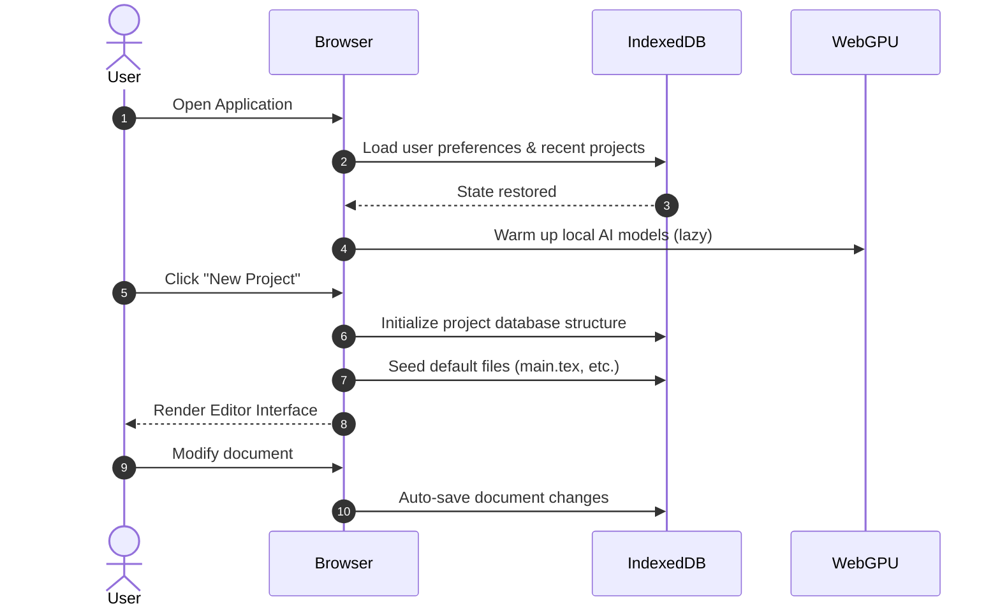
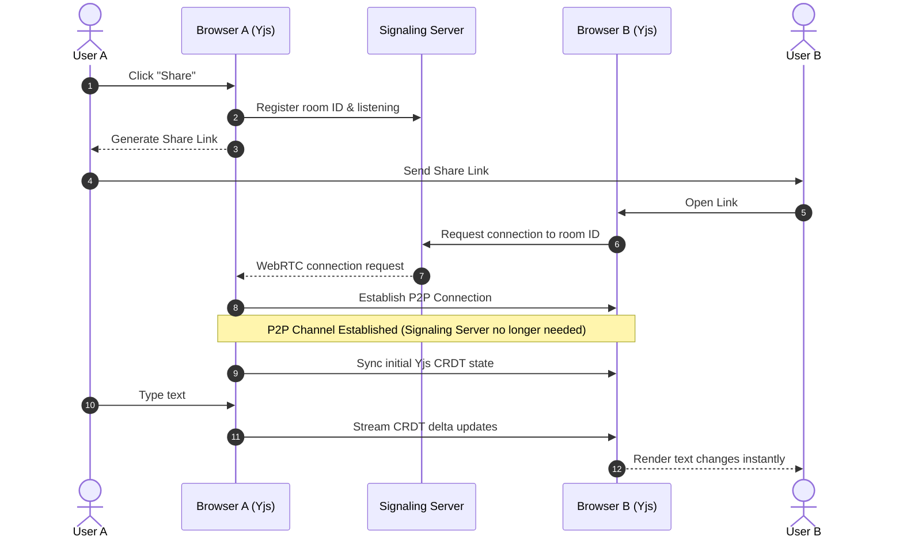
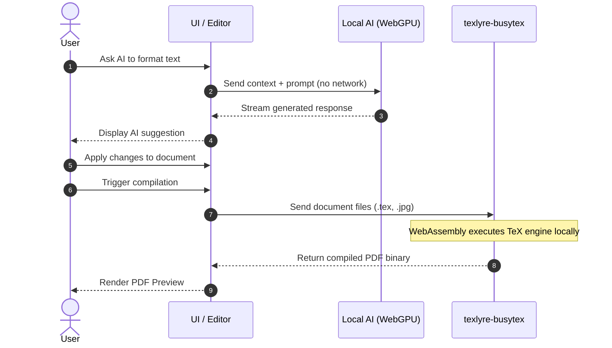

# Antiprism LaTeX Editor

[![DeepWiki](https://img.shields.io/badge/DeepWiki-lopkiloinm%2Fantiprism-blue.svg?logo=data:image/png;base64,iVBORw0KGgoAAAANSUhEUgAAACwAAAAyCAYAAAAnWDnqAAAAAXNSR0IArs4c6QAAA05JREFUaEPtmUtyEzEQhtWTQyQLHNak2AB7ZnyXZMEjXMGeK/AIi+QuHrMnbChYY7MIh8g01fJoopFb0uhhEqqcbWTp06/uv1saEDv4O3n3dV60RfP947Mm9/SQc0ICFQgzfc4CYZoTPAswgSJCCUJUnAAoRHOAUOcATwbmVLWdGoH//PB8mnKqScAhsD0kYP3j/Yt5LPQe2KvcXmGvRHcDnpxfL2zOYJ1mFwrryWTz0advv1Ut4CJgf5uhDuDj5eUcAUoahrdY/56ebRWeraTjMt/00Sh3UDtjgHtQNHwcRGOC98BJEAEymycmYcWwOprTgcB6VZ5JK5TAJ+fXGLBm3FDAmn6oPPjR4rKCAoJCal2eAiQp2x0vxTPB3ALO2CRkwmDy5WohzBDwSEFKRwPbknEggCPB/imwrycgxX2NzoMCHhPkDwqYMr9tRcP5qNrMZHkVnOjRMWwLCcr8ohBVb1OMjxLwGCvjTikrsBOiA6fNyCrm8V1rP93iVPpwaE+gO0SsWmPiXB+jikdf6SizrT5qKasx5j8ABbHpFTx+vFXp9EnYQmLx02h1QTTrl6eDqxLnGjporxl3NL3agEvXdT0WmEost648sQOYAeJS9Q7bfUVoMGnjo4AZdUMQku50McDcMWcBPvr0SzbTAFDfvJqwLzgxwATnCgnp4wDl6Aa+Ax283gghmj+vj7feE2KBBRMW3FzOpLOADl0Isb5587h/U4gGvkt5v60Z1VLG8BhYjbzRwyQZemwAd6cCR5/XFWLYZRIMpX39AR0tjaGGiGzLVyhse5C9RKC6ai42ppWPKiBagOvaYk8lO7DajerabOZP46Lby5wKjw1HCRx7p9sVMOWGzb/vA1hwiWc6jm3MvQDTogQkiqIhJV0nBQBTU+3okKCFDy9WwferkHjtxib7t3xIUQtHxnIwtx4mpg26/HfwVNVDb4oI9RHmx5WGelRVlrtiw43zboCLaxv46AZeB3IlTkwouebTr1y2NjSpHz68WNFjHvupy3q8TFn3Hos2IAk4Ju5dCo8B3wP7VPr/FGaKiG+T+v+TQqIrOqMTL1VdWV1DdmcbO8KXBz6esmYWYKPwDL5b5FA1a0hwapHiom0r/cKaoqr+27/XcrS5UwSMbQAAAABJRU5ErkJggg==)](https://deepwiki.com/lopkiloinm/antiprism)
<!-- DeepWiki badge generated by https://deepwiki.ryoppippi.com/ -->

**Antiprism** is a P2P decentralized LaTeX editor—the client-side counterpart to [Prism](https://prism.openai.com). Where Prism uses cloud services and centralized infrastructure, Antiprism runs entirely in your browser: no servers, no API keys, no data leaving your device.

## Architecture: Antiprism vs Prism

| Component | Prism (cloud) | Antiprism (client-side) |
|-----------|---------------|-------------------------|
| **Realtime collaboration** | WebSockets via central server | WebRTC + Yjs (peer-to-peer) |
| **AI assistant** | OpenAI API (datacenter) | LFM2.5-1.2B Q4 ONNX (WebGPU) |
| **LaTeX rendering** | Cloud compilation | Client-side WASM (texlyre-busytex) |
| **Data storage** | Server-side | IndexedDB, local-first |

- **WebRTC + Yjs**: Peers connect directly; a signaling server only helps establish connections and never sees document content.
- **WebGPU AI**: The [LiquidAI LFM2.5-1.2B](https://huggingface.co/LiquidAI/LFM2.5-1.2B-Instruct-ONNX) model runs in-browser, quantized to 4-bit (Q4) and exported to ONNX. No API keys, no network calls for inference.
- **Client-side LaTeX**: [texlyre-busytex](https://github.com/TeXlyre/texlyre-busytex) compiles and renders PDFs locally via WebAssembly.
- **Pandoc WASM**: The Agent mode outputs markdown (the model's native format); [pandoc-wasm](https://www.npmjs.com/package/pandoc-wasm) converts it to LaTeX in the browser.

### Key Features

**✅ Autosave & Persistence**: Automatic IndexedDB persistence via `y-indexeddb` ensures your documents are saved locally and restored on page reload.

**🌿 Git Integration**: Full version control built-in! Create commits, view history, compare diffs, and manage branches - all stored locally in IndexedDB.

**🎯 Tools Panel**: Comprehensive debugging and logging (Cmd+Shift+T). View LaTeX compilation output, AI interactions, and system logs with color-coded parsing.

**⌨️ Keyboard Shortcuts**: Boost productivity with shortcuts for sidebar toggle, tools panel, document formatting, and tab switching.

**🔄 Resizable UI**: Drag to resize editor, PDF viewer, and tools panels for your preferred workspace layout.

**🔧 Enhanced LaTeX**: Verbose BusyTeX logging, multiple engine support (XeLaTeX/LuaLaTeX/PdfLaTeX), and detailed error reporting.

### AI Chat Modes

| Mode | Purpose | Context | Model Used |
|------|---------|---------|------------|
| **Ask** | Q&A about the current document | Reference document + conversation history | LFM2.5-1.2B Q4 (Instruct) |
| **Agent** | Generate new LaTeX papers | Conversation history only (no reference doc) | LFM2.5-1.2B Q4 (Instruct) |
| **Vision** | Process images with text | Image + text prompts | LFM2.5-VL-1.6B (Vision) |
| **Multimodal** | Advanced vision-language understanding | Images + text with enhanced reasoning | Qwen3.5-0.8B (Multimodal) |

#### AI Models Overview

Antiprism uses three specialized LiquidAI models plus Alibaba's Qwen3.5 for multimodal understanding, all running entirely in your browser via WebGPU:

**1. LFM2.5-1.2B Q4 (Instruct Model)**
- **Purpose**: Text generation for chat, LaTeX assistance, and document creation
- **Architecture**: 1.2 billion parameters, 4-bit quantized for efficient browser execution
- **Processing**: Converts text tokens to embeddings, generates responses autoregressively
- **Specialization**: Instruction-following chat model trained for academic and technical writing
- **Runtime**: ONNX WebGPU inference with ~2GB memory usage
- **Use Cases**: 
  - Answering questions about your LaTeX document
  - Explaining LaTeX syntax and concepts
  - Generating new content in markdown format (converted to LaTeX via pandoc-wasm)

**2. LFM2.5-VL-1.6B (Vision Model)**
- **Purpose**: Multimodal understanding of images combined with text
- **Architecture**: 1.6 billion parameters with vision encoder and language model
- **Processing Pipeline**:
  1. **Image Preprocessing**: Splits images into 512×512 tiles, extracts 16×16 patches
  2. **Patch Encoding**: Each patch flattened to 768 values, normalized to [-1, 1]
  3. **Vision Encoder**: Processes patches through transformer layers
  4. **Multimodal Fusion**: Combines image embeddings with text token embeddings
- **Technical Details**:
  - Input shapes: `pixel_values: [num_tiles, 1024, 768]`, `attention_mask: [num_tiles, 1024]`
  - Supports up to 10 tiles + thumbnail for high-resolution images
  - Float16 precision for efficient GPU computation
- **Use Cases**:
  - Analyzing diagrams, charts, and mathematical figures
  - Explaining screenshots and visual content
  - Converting handwritten equations to LaTeX

**3. LFM2.5-1.2B (Thinking Model)**
- **Purpose**: Enhanced reasoning and step-by-step problem solving
- **Architecture**: Same 1.2B parameter base with specialized reasoning training
- **Processing**: Uses chain-of-thought prompting for complex problem decomposition
- **Specialization**: Trained for mathematical reasoning, proof generation, and logical deduction
- **Use Cases**:
  - Solving mathematical problems step-by-step
  - Generating proof structures and logical arguments
  - Debugging complex LaTeX code with reasoning

**4. Qwen3.5-0.8B (Alibaba Multimodal Model)**
- **Purpose**: Advanced vision-language understanding with enhanced reasoning capabilities
- **Architecture**: 0.8 billion parameters with unified vision-language foundation from Alibaba's Qwen team
- **Processing Pipeline**:
  1. **Vision Encoder**: Processes images through 16×16 patch extraction and transformer layers
  2. **Multimodal Fusion**: Early fusion of vision and language tokens for comprehensive understanding
  3. **Gated Delta Networks**: Efficient hybrid architecture with sparse Mixture-of-Experts
  4. **Enhanced Reasoning**: Built-in thinking capabilities for complex problem solving
- **Technical Details**:
  - Supports up to 262,144 token context length natively
  - Float16 precision for vision encoder, 4-bit quantized for text components
  - WebGPU-optimized with per-component dtype configuration
- **Multimodal Capabilities**:
  - Analyzing complex diagrams, charts, and mathematical figures
  - Understanding screenshots with detailed visual reasoning
  - Converting handwritten equations and diagrams to LaTeX
  - Processing multiple images in conversation context
- **Vision Support**:
  - Image preprocessing with 448×448 resizing
  - Multi-tile processing for high-resolution images
  - Visual token integration with text tokens
  - Cross-generational parity with text-only performance

#### Model Integration

All four models share the same WebGPU runtime infrastructure:
- **ONNX Runtime Web**: Executes models directly in browser GPU
- **Transformers.js**: Advanced model loading with per-component optimization
- **Cache API**: Models cached locally after first download (~800MB total)
- **Memory Management**: Efficient tensor operations with automatic cleanup
- **Type Handling**: Supports both float32 and float16 precision
- **Streaming**: Real-time token generation for responsive chat experience

- **Ask**: Uses the open document as context. Good for editing, debugging, and explaining LaTeX.
- **Agent**: Model outputs markdown; pandoc-wasm converts to LaTeX. New files are named from the first `#` heading. Conversation history uses markdown (not LaTeX) so the model stays in its trained format.
- **Vision**: Attach images to chat messages for multimodal understanding. The vision encoder processes images alongside text for comprehensive analysis.
- **Multimodal**: Advanced Qwen3.5 model processes images and text with enhanced reasoning. Supports complex visual understanding, mathematical figure analysis, and detailed image-to-LaTeX conversion with built-in thinking capabilities.

---

## Features

### Dashboard

- **Projects & Rooms**: Create projects (local) or rooms (shared via WebRTC room ID).
- **Sidebar**: All Projects, Your Projects, Your Rooms.
- **Search**: Filter projects/rooms by name.
- **View modes**: List or icon view.
- **Import**: Zip files or entire folders.
- **Delete**: Permanently removes project/room and all IndexedDB data.

### Project Editor

- **File tree**: Hierarchical browser with infinite nesting.
  - Add file/folder into the selected folder.
  - Upload file or directory.
  - Right-click: Rename, Download, Delete.
  - Empty folders stay open; only non-empty folders can be collapsed.
- **Tabs**: Multiple open files; close deletes the tab (and closes the tab when the file is deleted).
- **CodeMirror 6**: LaTeX syntax highlighting, One Dark theme.
- **Yjs + y-webrtc**: Real-time collaborative editing; edits sync peer-to-peer.
- **✅ Autosave**: Automatic persistence with IndexedDB via `y-indexeddb` - never lose work!
- **PDF preview**: Scrollable multi-page view, zoom, download.
- **AI assistant**: In-browser chat with four modes—**Ask** (Q&A about the current document), **Agent** (generates new papers from markdown, converted to LaTeX via pandoc-wasm), **Vision** (process images with text), and **Multimodal** (advanced Qwen3.5 vision-language understanding with enhanced reasoning).
- **🎯 Tools Panel**: Comprehensive logging and debugging panel (Cmd+Shift+T).
  - **Summary**: Document statistics and analysis.
  - **AI Logs**: AI model interaction logs.
  - **🔧 LaTeX Logs**: Complete BusyTeX compilation output with color-coded parsing.
  - **Typst Logs**: Typst compilation logs.
- **⌨️ Keyboard Shortcuts**: Productivity shortcuts for common actions.
  - `Cmd+B`: Toggle sidebar
  - `Cmd+Shift+T`: Toggle tools panel
  - `Cmd+Shift+F`: Format document
  - `Cmd+1/2/3`: Switch sidebar tabs (Files/Chats/Git)
- **🔄 Resizable Panels**: Drag to resize editor, PDF, and tools panels.

### Git Integration

- **🌿 Git Panel**: Full-featured version control for projects.
  - **Repository Management**: Automatic git repo creation per project.
  - **Commit History**: View and browse commit timeline.
  - **File Changes**: Real-time change detection (added/modified/deleted).
  - **Staging**: Selectively stage files for commits.
  - **Diff Views**: Compare file versions with side-by-side and unified diffs.
  - **Branch Switching**: Custom-styled branch dropdown (main/feature/develop).
- **🔍 Persistent Storage**: Git data stored in IndexedDB with stable naming.
- **📊 Change Detection**: Automatic file monitoring and change tracking.
- **🎯 Visual Diff**: Rich diff display with syntax highlighting and line numbers.

### LaTeX Compilation

- **texlyre-busytex**: WebAssembly TeX engine.
- Compiles on demand; PDF updates after each compile.
- Supports `main.tex`, images, and additional `.tex` files.
- **🔧 Verbose Logging**: Complete LaTeX compilation output in tools panel.
- **🎯 Error Debugging**: Color-coded error messages, warnings, and debug info.
- **⚡ Multiple Engines**: XeLaTeX, LuaLaTeX, PdfLaTeX with automatic fallback.
- **📊 Compilation Stats**: Engine used, success status, timing information.

---

## Prerequisites

- **Node.js** 20.9+
- **Browser** with WebGPU support: Chrome 113+, Edge 113+, Safari 18+

---

## Setup

```bash
# Install dependencies
npm install

# Download LaTeX WASM assets (~175MB)
npm run download-latex-assets

# Start dev server
npm run dev
```

Open [http://localhost:3000](http://localhost:3000).

### Scripts

| Script | Description |
|--------|-------------|
| `npm run dev` | Start Next.js dev server |
| `npm run build` | Build for production (webpack) |
| `npm run start` | Start production server |
| `npm run lint` | Run ESLint |
| `npm run download-latex-assets` | Download texlyre-busytex WASM assets to `./public/core` |

---

## Deployment (GitHub Pages)

The workflow in `.github/workflows/nextjs.yml` builds and deploys to GitHub Pages on push to `main`. **You must enable Pages first:**

1. Go to your repo on GitHub: **Settings** → **Pages**
2. Under **Build and deployment** → **Source**, select **GitHub Actions**
3. Save (no branch selection needed—the workflow deploys the artifact)

After enabling, push to `main` or run the workflow manually from the **Actions** tab. The site will be at `https://<username>.github.io/antiprism/`.

---

## Project Structure

```
├── app/
│   ├── layout.tsx          # Root layout, metadata
│   ├── page.tsx             # Dashboard (projects/rooms)
│   ├── project/[id]/page.tsx # Project editor
│   └── globals.css
├── components/
│   ├── DashboardHeader.tsx  # Search, view toggle, import, New
│   ├── DashboardSidebar.tsx # Nav: All / Projects / Rooms
│   ├── ProjectList.tsx      # Project/room cards, delete
│   ├── FileTree.tsx         # IDBFS file browser, context menu
│   ├── FileActions.tsx      # Add file/folder, upload
│   ├── FileTabs.tsx         # Open tabs with tools toggle
│   ├── EditorPanel.tsx      # CodeMirror + Yjs
│   ├── PdfPreview.tsx       # PDF viewer (react-pdf)
│   ├── ImageViewer.tsx      # Image preview
│   ├── NameModal.tsx        # Rename/create dialogs
│   ├── ToolsPanel.tsx       # 🎯 Logging panel with LaTeX/AI/Typst logs
│   ├── GitPanelReal.tsx     # 🌿 Full git integration (commits, diffs, staging)
│   ├── GitDiffView.tsx      # Unified diff viewer
│   ├── SideBySideDiffView.tsx # Side-by-side diff comparison
│   ├── ResizableDivider.tsx # 🔄 Resizable panel dividers
│   ├── SummaryView.tsx       # Document statistics display
│   └── Icons.tsx            # Icon components (Git, tools, etc.)
├── hooks/
│   └── useKeyboardShortcuts.ts # ⌨️ Global keyboard shortcuts
├── lib/
│   ├── agent/               # AI chat modes
│   │   ├── ask.ts           # Ask: Q&A with document context
│   │   ├── create.ts        # Agent: markdown → pandoc-wasm → LaTeX
│   │   ├── index.ts         # buildMessages, parseCreateResponse
│   │   └── types.ts
│   ├── projects.ts          # Project/room CRUD, IDBFS cleanup
│   ├── localModelRuntime.ts # AI model (transformers.js, Cache API)
│   ├── localModel.ts        # Model API exports
│   ├── latexCompiler.ts     # 🔧 texlyre-busytex wrapper with verbose logging
│   ├── gitStore.ts          # 🌿 IndexedDB git repository management
│   ├── logger.ts            # 📊 Centralized logging system (AI/LaTeX/Typst/System)
│   ├── editorBufferManager.ts # ✅ In-memory buffer management
│   ├── wasmLatexTools.ts    # LaTeX formatting and word counting
│   ├── typst-parser.ts      # Typst document parsing
│   ├── settings.ts          # App configuration
│   └── idbfsAdapter.ts      # File manager helpers
├── public/
│   ├── main.tex             # Default document (Antiprism intro)
│   ├── diagram.jpg          # Sample image
│   └── core/                # LaTeX WASM assets (after download)
├── PACKAGES.md              # Package docs & snippets
└── package.json
```

---

## Tech Stack

| Category | Packages |
|----------|----------|
| **Framework** | Next.js 16, React 19 |
| **Collaboration** | Yjs, y-webrtc, y-codemirror.next, y-indexeddb |
| **Editor** | CodeMirror 6, codemirror-lang-latex |
| **Storage** | @wwog/idbfs (IndexedDB filesystem) |
| **Version Control** | Custom git implementation with IndexedDB |
| **LaTeX** | texlyre-busytex (WASM), pandoc-wasm (md→tex), wasm-latex-tools |
| **AI** | @huggingface/transformers (LFM2.5-1.2B Q4 ONNX, LFM2.5-VL-1.6B, Qwen3.5-0.8B) |
| **PDF** | react-pdf |
| **Styling** | Tailwind CSS |
| **Utilities** | diff (for git diffs), exifreader (image metadata) |

---

## User Flows

### 1. Application Initialization & New Project Creation



### 2. Collaborative Document Editing (Yjs + WebRTC)



### 3. Local AI Interaction & Document Compilation



---

## Packages

See [PACKAGES.md](./PACKAGES.md) for detailed usage and code snippets for Yjs, y-webrtc, CodeMirror, and related libraries.
